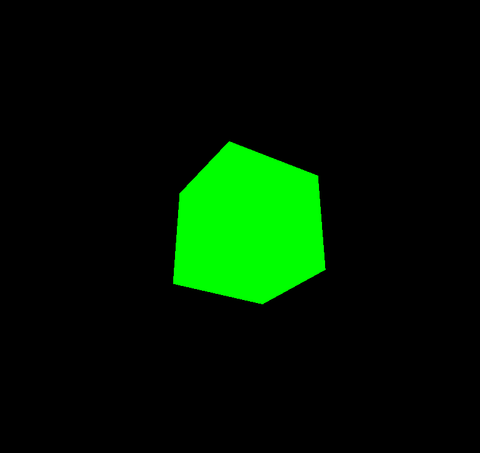
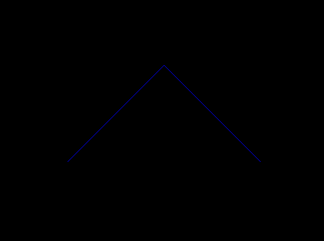
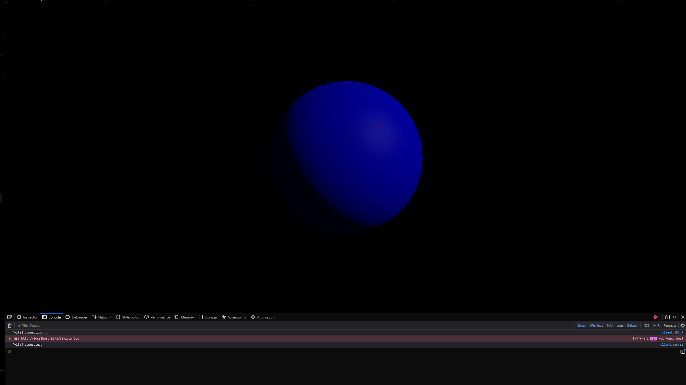
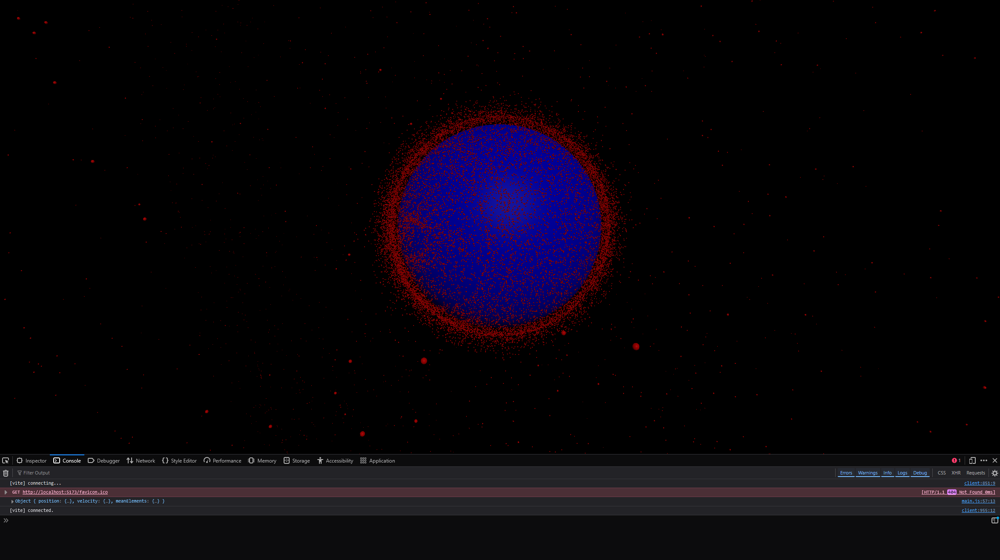
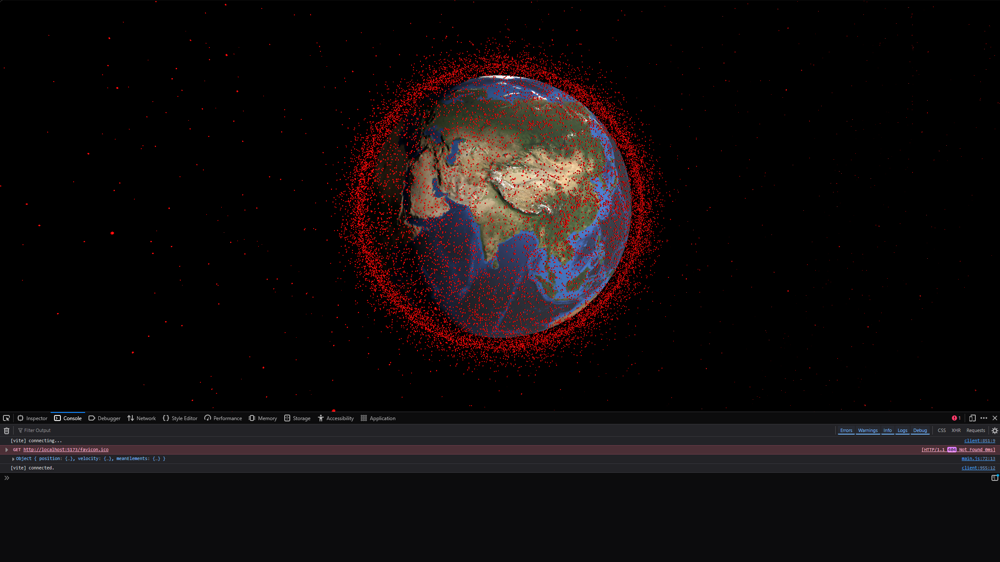
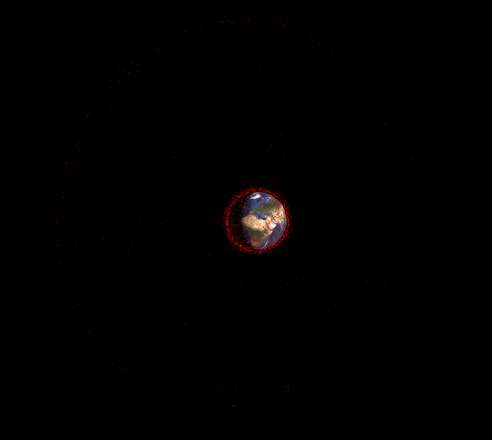

# DATA VISUALISATION PROJECT
## Initial Ideas

- I want to use data visualisation to convey something to do with space
- Some ideas include the speed of galaxies moving away from us or towards us
- Could use red and blue light shift somehow

- I want it to draw the user in by not throwing scientific jargon at them
- Make it immersive somehow, could use music or sound in some way?

Sounds of the Sun springs to mind because I remember it being something that interested me a few years ago - https://www.nasa.gov/solar-system/sounds-of-the-sun/

#### what data sets or APIs are available regarding space?
- Exoplanet Datasets - https://exoplanetarchive.ipac.caltech.edu/docs/data.html
- Daily Sunspots Dataset (1850 - 2026) - https://www.kaggle.com/datasets/patrickfleith/daily-sunspots-dataset
- Space debris and satellites around the earth (requires login) - https://www.space-track.org/

visualising debris around earth would be interesting and fun to make. could combine it with sounds of the sun idea somehow?

have no idea how to go about rendering 3D objects so will do some research:
- three.js seems like a good idea
- need to spend some time learning how to use it first
- also have no idea how to use space-track's data so will need to research that too

## Learning three.js
https://threejs.org/manual/ - using this as a guide on how to use threejs

### Making a cube, then animating it
```javascript
import * as THREE from 'three';

const scene = new THREE.Scene();
const camera = new THREE.PerspectiveCamera(
    75, // FOV
    window.innerWidth / window.innerHeight, // Aspect Ratio
    0.1, // Near clipping plane
    1000 // Far clipping plane (in z axis i think)
); 

// a renderer takes raw data as input and translates it into a 2D image
const renderer = new THREE.WebGLRenderer(); 
renderer.setSize(window.innerWidth, window.innerHeight);
document.body.appendChild(renderer.domElement);

const geometry = new THREE.BoxGeometry(1,1,1); // these units are arbitrary from what I understand
const material = new THREE.MeshBasicMaterial({color: 0x00ff00});

// take the geometry, apply a material to it
const cube = new THREE.Mesh(geometry, material);

//add object to scene at position 0,0,0
scene.add(cube); 

// camera is also at 0,0,0 so move it a little so they dont overlap with each other
// z is "depth" on a 2d screen. positive z is towards the viewer from what I understand
camera.position.z = 5;

function animate(time) {
    cube.rotation.x = time / 2000;
    cube.rotation.y = time / 1000;
    renderer.render(scene, camera);
}

renderer.setAnimationLoop(animate);
```


### Learning how to draw lines
```javascript
import * as THREE from 'three';

const renderer = new THREE.WebGLRenderer();
renderer.setSize( window.innerWidth, window.innerHeight );
document.body.appendChild( renderer.domElement );

const camera = new THREE.PerspectiveCamera( 45, window.innerWidth / window.innerHeight, 1, 500 );
camera.position.set( 0, 0, 100 );
camera.lookAt( 0, 0, 0 );

const scene = new THREE.Scene();

// define a material - for lines we use either LineBasicMaterial or LineDashedMaterial
const material = new THREE.LineBasicMaterial( {color:0x0000ff});

// i dont get how this works, will come back to this
// nvm i get it
// explanation for future self:
// similar to making a cube you need geometry, apply a material to it, and then add it to the scene
// for the cube, we used THREE.mesh(geometry, material)
// but since this is just lines (not a 3D object I assume), we use THREE.Line(geometry,material)
// I guess these count as 3D objects as each point is a 3D vector

const points = [];
points.push( new THREE.Vector3( - 10, 0, 0 ) );
points.push( new THREE.Vector3( 0, 10, 0 ) );
points.push( new THREE.Vector3( 10, 0, 0 ) );

const geometry = new THREE.BufferGeometry().setFromPoints( points );

const line = new THREE.Line( geometry, material );

scene.add( line );

// modified and added this bit to see if the lines rotate in 3d space... they do, meaning they count as a 3D object?
function animate(time) {
    line.rotation.y = time / 2000;
    renderer.render(scene, camera);
}

renderer.setAnimationLoop(animate);
```


These basic tutorials were provided on the threejs website, but I'm going to read the docs to see if I can render a circle using lines, and a sphere (not using lines). From there, I can try to figure out how to maybe start plotting orbits around a sphere using data.

The threejs website has a page on how to use "scenegraphs". This seems like it would be very useful to use these in this project - https://threejs.org/manual/#en/scenegraph. The examples provided use orbits to explain how nodes in the scene graph work

IMPORTANT DEFINITION - A scene graph in a 3D engine is a hierarchy of nodes in a graph where each node represents a local space.

This might not be necessary as I'm not going to be applying rotation to the Earth that should affect the satellites

Currently learning about material types, primitives, and how to use lil-gui.

lil-gui provides a simple way to change the value of certain variables/parameters in real time for the render. Will let me find good positions for light or camera if needed.
https://lil-gui.georgealways.com/

From space-track.org I requested then downloaded a json containing all non-decayed orbits. This includes functioning satellites, debris, and everything else. Each satellite is formatted like this:
```json
{
    "CCSDS_OMM_VERS": "3.0",
    "COMMENT": "GENERATED VIA SPACE-TRACK.ORG API",
    "CREATION_DATE": "2026-06-06T17:50:36",
    "ORIGINATOR": "18 SPCS",
    "OBJECT_NAME": "VANGUARD 1",
    "OBJECT_ID": "1958-002B",
    "CENTER_NAME": "EARTH",
    "REF_FRAME": "TEME",
    "TIME_SYSTEM": "UTC",
    "MEAN_ELEMENT_THEORY": "SGP4",
    "EPOCH": "2026-06-06T06:02:55.726368",
    "MEAN_MOTION": "10.85993221",
    "ECCENTRICITY": "0.18354653",
    "INCLINATION": "34.2474",
    "RA_OF_ASC_NODE": "348.0744",
    "ARG_OF_PERICENTER": "89.1892",
    "MEAN_ANOMALY": "291.7390",
    "EPHEMERIS_TYPE": "0",
    "CLASSIFICATION_TYPE": "U",
    "NORAD_CAT_ID": "5",
    "ELEMENT_SET_NO": "999",
    "REV_AT_EPOCH": "44209",
    "BSTAR": "0.00048480245000",
    "MEAN_MOTION_DOT": "0.00000355",
    "MEAN_MOTION_DDOT": "0.0000000000000",
    "SEMIMAJOR_AXIS": "8613.581",
    "PERIOD": "132.598",
    "APOAPSIS": "3816.439",
    "PERIAPSIS": "654.453",
    "OBJECT_TYPE": "PAYLOAD",
    "RCS_SIZE": "MEDIUM",
    "COUNTRY_CODE": "US",
    "LAUNCH_DATE": "1958-03-17",
    "SITE": "AFETR",
    "DECAY_DATE": null,
    "FILE": "5233480",
    "GP_ID": "327573891",
    "TLE_LINE0": "0 VANGUARD 1",
    "TLE_LINE1": "1 00005U 58002B   26157.25203387  .00000355  00000-0  48480-3 0  9991",
    "TLE_LINE2": "2 00005  34.2474 348.0744 1835465  89.1892 291.7390 10.85993221442090"
  },
```
The json is huge, and I don't need all the data provided for each satellite. I just need the necessary information to draw orbits in threejs. Once I have orbits drawn for each satellite, I no longer need to use this JSON, so at initialisation I should propagate all orbits and have them in an array or list. I will use satellite.js for this found at - https://github.com/shashwatak/satellite-js

The necessary data just to plot an orbit is gained from TLE_LINE1 and TLE_LINE2.

I got quite confused for awhile as to how I will be able to get the data safely, as the API I will be using requires login credentials and I need to run this on a "backend" to make sure users can't find out my login details within the browser. Since I will be running this app on github pages, the frontend will be getting data from the all-satellites.json file. I will use something I have discovered called "github actions", which will let me run a nodejs script once a day. I will use this script to request a JSON from the API, and use that data to update all-satellites.json. How exactly to do this... I will find out in time.

This was a rabbit hole for a few hours, so I will come back to this. For now, I will use the JSON file  I currently have for the frontend, and try to create an orbiting object around a 3D sphere that represents Earth.

- I'm using a library called satellite.js which using an algorithm called SGP4 to convert TLE to position and velocity using a specific epoch. I will use these vectors to draw an orbit (somehow)

Initial ideas before more research:
- equation for circle is pi*(r^2)
- could calculate that, then somehow transform it into the correct position and shape? something to do with eccentricity and inclination
- do I want to draw a line for each orbit? that could get messy fast. instead, maybe I just make a particle for the satellite and move it.
- will require updating the position of the particle every time step. thats what initial position at the start time is for, and then the velocity. how do i use this to rotate around a point though? 
much to think about.
- Answer: satellite.js does this for me. I just need to change the time by [timestep] amount and i will be provided with a new position vector 

I will write some code that creates a blue sphere to represent earth, and a red tiny sphere to represent a satellite. I don't need it to move yet, I just want to render these shapes.

My current code:

```javascript
import * as THREE from 'three';

function main() {
    const renderer = new THREE.WebGLRenderer();
    renderer.setSize( window.innerWidth, window.innerHeight );
    document.body.appendChild( renderer.domElement );

    const camera_max_range = 1000;

    const camera = new THREE.PerspectiveCamera( 45, window.innerWidth / window.innerHeight, 1, camera_max_range);
    camera.position.set( 0, 0, 50 );
    camera.lookAt( 0, 0, 0 );

    const scene = new THREE.Scene();

    const color = 0xFFFFFF;
    const intensity = 1;
    const light = new THREE.DirectionalLight(color, intensity);
    light.position.set(15, 15, 15);
    light.target.position.set(-5, 0, 0);
    scene.add(light);
    scene.add(light.target);

    const amb_intensity = 0.01;
    const amb_light = new THREE.AmbientLight(color, amb_intensity);
    scene.add(amb_light);

    // make a sphere for earth
    const earth_radius = 10; // in "scene units" (i made that up but it makes sense to me that way)

    const earth_geometry = new THREE.SphereGeometry(earth_radius, 100, 100);
    const earth_material = new THREE.MeshPhongMaterial({color: 'blue'});

    const earth_sphere = new THREE.Mesh(earth_geometry, earth_material);

    scene.add(earth_sphere)

    // use this scale to convert km above earth's center to scene units for satellite positions
    const SCALE_KM_TO_SCENE_UNITS = 10 / 6371;

    // make a tiny sphere for satellite
    const satellite_radius = 0.1;

    const satellite_geometry = new THREE.SphereGeometry(satellite_radius, 10, 10);
    const satellite_material = new THREE.MeshPhongMaterial({color: 'red'});

    const satellite_sphere = new THREE.Mesh(satellite_geometry, satellite_material);
    satellite_sphere.position.set(3, 3, 15);

    scene.add(satellite_sphere);

    renderer.render(scene, camera);
}
main();
```


Now that I have both of these rendered, I need to find a way to update the position of the satellite every frame.

Before I do that, I think it will be useful to be able to zoom in and out using mouse wheel, and also move the camera using left click and drag. Maybe use event listener? 

threejs has an addon called OrbitControls which provides this functionality

apparently I should use InstancedMesh as it allows for drawing many of the same object. Need to figure out how this works. 

According to /u/thespite https://www.reddit.com/r/threejs/comments/w55mdq/how_to_get_instancedmesh_working_properly/ a transformation matrix needs to be applied to each instance to give it a "position" each frame.

https://threejs.org/docs/#Matrix4 - this shows how to make a new matrix, and then apply x, y, z transform to it using MakeTranslation. Will try to apply this to each instancedMesh and see if that works?

It worked! After a lot of messing around with the code and fixing some errors and typos I managed to create a still frame of all satellites at the current time (based on the specific time the code runs). Here is a screenshot:



And here is the code:
```javascript
import * as THREE from 'three';
import { OrbitControls } from 'three/addons/controls/OrbitControls.js';
import * as satellite from 'satellite.js';


async function main() {
    const response = await fetch("./public/all-satellites.json");
    const satellite_objs = await response.json();   
    
    const renderer = new THREE.WebGLRenderer();
    renderer.setSize( window.innerWidth, window.innerHeight );
    document.body.appendChild( renderer.domElement );

    const camera_max_range = 1000;

    const camera = new THREE.PerspectiveCamera( 45, window.innerWidth / window.innerHeight, 1, camera_max_range);
    camera.position.set( 0, 0, 50 );
    camera.lookAt( 0, 0, 0 );

    const camera_controls = new OrbitControls(camera, renderer.domElement);
    camera_controls.target.set(0, 0, 0);

    const scene = new THREE.Scene();

    const color = 0xFFFFFF;
    const intensity = 1;
    const light = new THREE.DirectionalLight(color, intensity);
    light.position.set(15, 15, 15);
    light.target.position.set(-5, 0, 0);
    scene.add(light);
    scene.add(light.target);

    const amb_intensity = 0.05;
    const amb_light = new THREE.AmbientLight(color, amb_intensity);
    scene.add(amb_light);

    // make a sphere for earth
    const earth_radius = 10; // in "scene units" (i made that up but it makes sense to me that way)

    const earth_geometry = new THREE.SphereGeometry(earth_radius, 100, 100);
    const earth_material = new THREE.MeshPhongMaterial({color: 'blue'});

    const earth_sphere = new THREE.Mesh(earth_geometry, earth_material);

    scene.add(earth_sphere)

    // use this scale to convert km above earth's center to scene units for satellite positions
    const SCALE_KM_TO_SCENE_UNITS = 10 / 6371;

    // create a list of all satellite records
    let sat_recs = []
    for (const satellite_obj of satellite_objs) {
        const sat_record = satellite.twoline2satrec(satellite_obj.TLE_LINE1, satellite_obj.TLE_LINE2);
        sat_recs.push(sat_record);
    }
    console.log(satellite.propagate(sat_recs[0], new Date()));
    // use instancedmesh to allow for thousands of the same shape to be used

    const num_of_sats = satellite_objs.length;
    const sat_geometry = new THREE.SphereGeometry(0.05,8,8);
    const sat_material = new THREE.MeshPhongMaterial({color: 'red'});
    const sat_mesh = new THREE.InstancedMesh(sat_geometry, sat_material, num_of_sats);
    scene.add(sat_mesh);

    // create matrix to apply transformations to each instanced mesh

    const matrix = new THREE.Matrix4();
    let current_time = new Date();

    for (let i = 0; i < sat_recs.length; i++) {
        const propagated_sat = satellite.propagate(sat_recs[i], current_time);
        
        // was getting error of null propagated_sat so added this check to prevent trying to access position of null values
        if (!propagated_sat || !propagated_sat.position) { continue }; 

        let x = propagated_sat.position.x * SCALE_KM_TO_SCENE_UNITS;
        let y = propagated_sat.position.y * SCALE_KM_TO_SCENE_UNITS;
        let z = propagated_sat.position.z * SCALE_KM_TO_SCENE_UNITS;


        matrix.makeTranslation(x,y,z);

        sat_mesh.setMatrixAt(i, matrix);
    }

    sat_mesh.instanceMatrix.needsUpdate = true;

    function animate( time ) {
        camera_controls.update();
        renderer.render( scene, camera );
    }

    renderer.setAnimationLoop(animate);
}
main();
```

I tried updating the satellites every frame but it absolutely tanked my PC, so I'm going to try updating them way less often.

--UPDATE--

I don't understand why, but I reloaded the page and now everything is running perfectly?? I made no modification to the code so I don't know why its now working but sure.

## Adding audio based on the satellites
Now that I have a working simulation, the next step is to incorporate sound. I want it to be generated from the satellite data I have somehow.

Ideas from research/brain:
- I could use different data for things like altitude = pitch or eccentricity = volume
- Each satellite produces it's own sound, I worry that might be too noisy
- Could group satellites based on position and get a mean average value for data?

In the meantime, I'm going to try replacing the blue sphere that represents Earth with a 3D model of earth following this guide - https://threejs.org/manual/#en/loading-3d-models

I'm using a model from NASA https://science.nasa.gov/resource/earth-3d-model/

```javascript
import * as THREE from 'three';
import { OrbitControls } from 'three/addons/controls/OrbitControls.js';
import * as satellite from 'satellite.js';
import { GLTFLoader } from 'three/addons/loaders/GLTFLoader.js';


async function main() {
    const response = await fetch("./all-satellites.json");
    const satellite_objs = await response.json();   
    
    const renderer = new THREE.WebGLRenderer();
    renderer.setSize( window.innerWidth, window.innerHeight );
    document.body.appendChild( renderer.domElement );

    const camera_max_range = 1000;

    const camera = new THREE.PerspectiveCamera( 45, window.innerWidth / window.innerHeight, 1, camera_max_range);
    camera.position.set(0, 0, 50);
    camera.lookAt(0, 0, 0);

    const camera_controls = new OrbitControls(camera, renderer.domElement);
    // the point that the camera will rotate around
    camera_controls.target.set(0, 0, 0);

    const scene = new THREE.Scene();

    const color = 0xFFFFFF;
    const intensity = 10;
    const light = new THREE.DirectionalLight(color, intensity);
    light.position.set(20, 5, 50);
    light.target.position.set(-5, 0, 0);
    scene.add(light);
    scene.add(light.target);

    const amb_intensity = 0.1;
    const amb_light = new THREE.AmbientLight(color, amb_intensity);
    scene.add(amb_light);

    // make a sphere for earth
    const loader = new GLTFLoader();
    let earth;

    // code here adapted from https://threejs.org/manual/#en/loading-3d-models
    loader.load( "./earth-model.glb", function (gltf) {
        earth = gltf.scene;
        earth.scale.set(0.02, 0.02, 0.02);
        earth.rotation.x = THREE.MathUtils.degToRad(23.4) // earths tilt, i applied it to x as y and z didnt look correct to me
        scene.add(earth);
        }, undefined, function (error) {
            console.error(error);
        });
    
    // const earth_radius = 10; // in "scene units" (i made that up but it makes sense to me that way)

    // const earth_geometry = new THREE.SphereGeometry(earth_radius, 100, 100);
    // const earth_material = new THREE.MeshPhongMaterial({color: 'blue'});

    // const earth_sphere = new THREE.Mesh(earth_geometry, earth_material);

    // scene.add(earth_sphere)

    // use this scale to convert km above earth's center to scene units for satellite positions
    const SCALE_KM_TO_SCENE_UNITS = 10 / 6371; // 6371 is the earth's radius (if it was a sphere)

    // create a list of all satellite records
    let sat_recs = []
    for (const satellite_obj of satellite_objs) {
        const sat_record = satellite.twoline2satrec(satellite_obj.TLE_LINE1, satellite_obj.TLE_LINE2);
        sat_recs.push(sat_record);
    }
    console.log(satellite.propagate(sat_recs[0], new Date()));

    // use instancedmesh to allow for thousands of the same shape to be used
    const num_of_sats = satellite_objs.length;
    const sat_geometry = new THREE.SphereGeometry(0.04,8,8);
    const sat_material = new THREE.MeshPhongMaterial({color:"red"});
    const sat_mesh = new THREE.InstancedMesh(sat_geometry, sat_material, num_of_sats);
    scene.add(sat_mesh);

    // create matrix to apply transformations to each instanced mesh
    const matrix = new THREE.Matrix4();
    let current_time = new Date();
    
    function animate(time) {
        camera_controls.update();
        if (earth) {earth.rotation.y += 0.001;} // check to make sure earth model exists
        else {return} // prevents anything from rendering until 3d model finished loading
        
        renderer.render( scene, camera );
        for (let i = 0; i < sat_recs.length; i++) {
            const propagated_sat = satellite.propagate(sat_recs[i], current_time);
            
            // was getting error of null propagated_sat so added this check to prevent trying to access position of null values
            if (!propagated_sat || !propagated_sat.position) { continue }; 

            let x = propagated_sat.position.x * SCALE_KM_TO_SCENE_UNITS;
            let y = propagated_sat.position.y * SCALE_KM_TO_SCENE_UNITS;
            let z = propagated_sat.position.z * SCALE_KM_TO_SCENE_UNITS;


            matrix.makeTranslation(x,y,z);

            sat_mesh.setMatrixAt(i, matrix);
    }

    sat_mesh.instanceMatrix.needsUpdate = true;
    current_time = new Date(current_time.getTime() + 1000);
    }

    renderer.setAnimationLoop(animate);
}
main();
```


